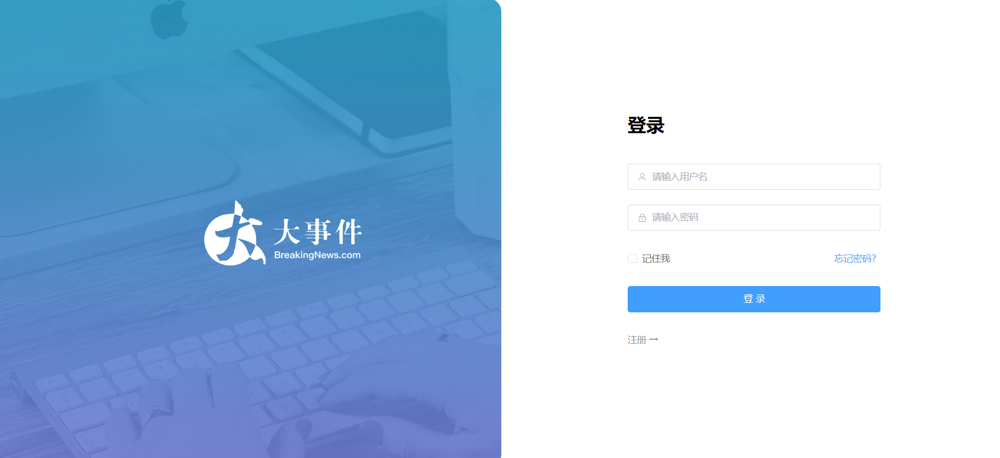
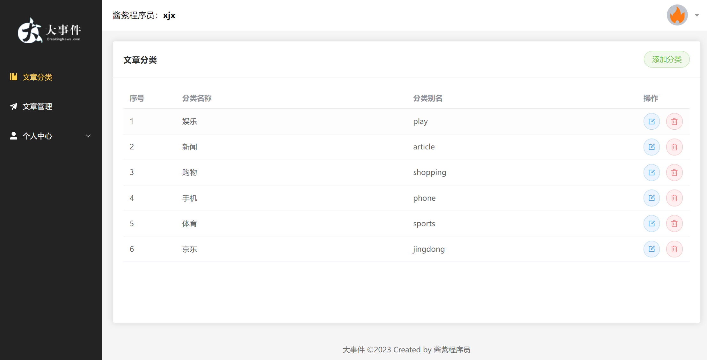
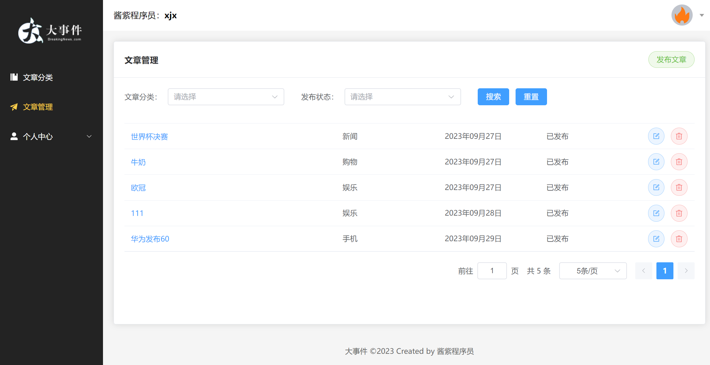
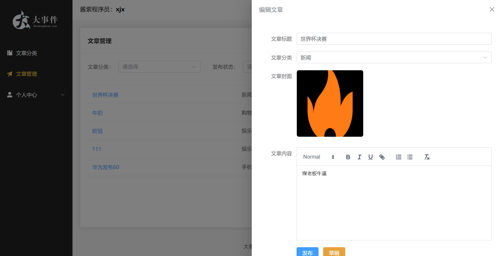

#  Big-event项目

Vue3 大事件管理系统

接口文档：https://apifox.com/apidoc/shared-26c67aee-0233-4d23-aab7-08448fdf95ff/api-93850835

接口根路径： http://big-event-vue-api-t.itheima.net

## 1.	项目简介

本项目是在vue3学习阶段练习的一个前端事件管理后台系统

### 1.1	主要技术栈有：

- HTML、ES6、CSS、Axios
- 构建框架是：Vue3
- 状态管理是：pinia
- 构建工具：vite
- 组件库：element-plus
- 路由管理：vue-router
- 包管理器：pnpm

## 2.	项目功能

1. 首页登录：用户注册、登录功能。
2. 事件分类：对文章分类的管理（编辑、删除、添加）。
3. 事件管理：对事件详情的编辑，添加，删除，发布，草稿。
4. 个人中心：修改个人账号信息
5. 自动获取网上事件：（还在更新中）

## 3.	项目演示

演示账号\密码：1shuaixu\123456

在线演示地址：https://fe-bigevent-web.itheima.net/login（上线之后还得继续更改）

